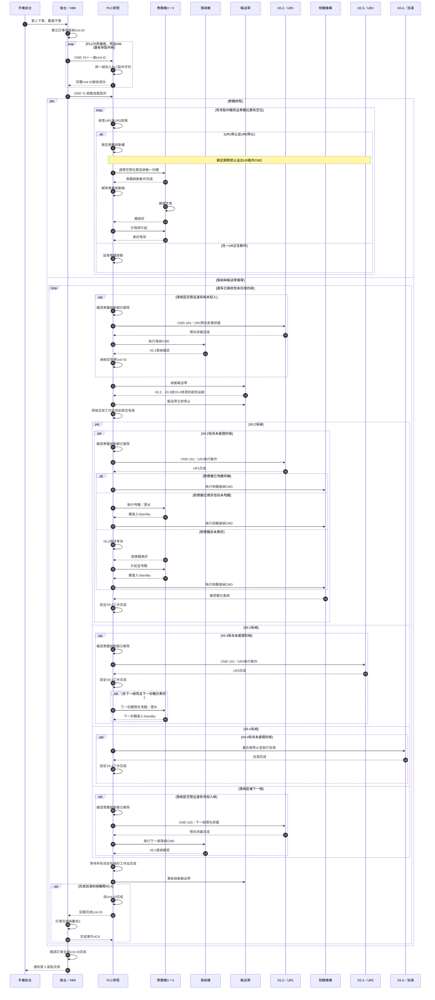
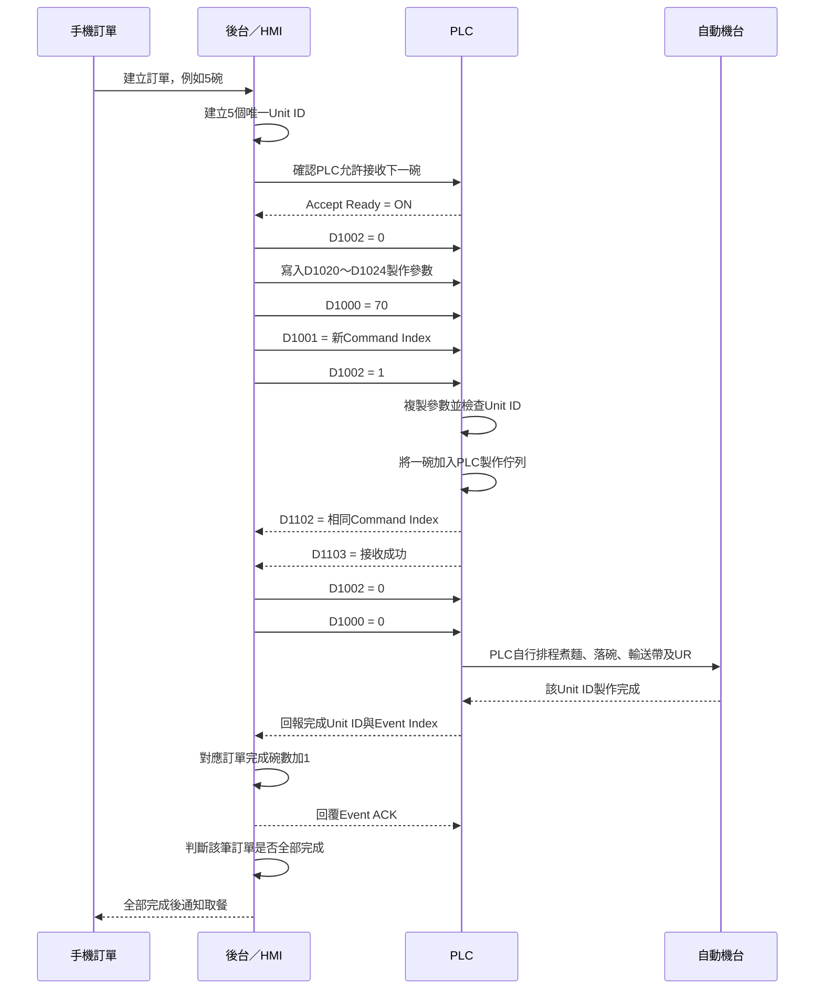
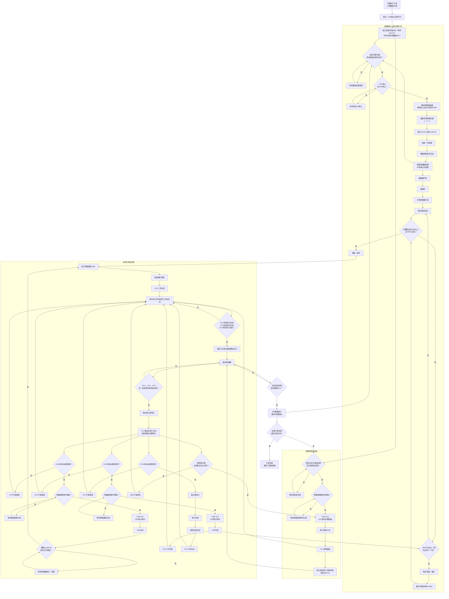
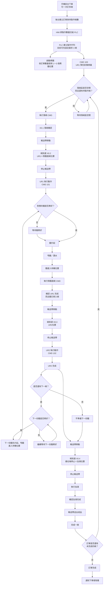

# 規劃自建點餐系統——原聊天匯出第 036 頁

Thread ID：01a0128c-710d-7be2-9e8d-3e60d4f5b5d0
順序：API以最新到最舊分頁；本頁內依回傳順序保存。

## Turn 01a01393-f5fa-7601-856c-6068cacd6f63

### 使用者

對每一碗的編號


### AI（final_answer）

對，`Unit ID`就是「每一碗的唯一編號」，不是整筆訂單編號。

例如客人訂3碗：

```text
Order ID：A00025

第1碗：Unit ID 1001
第2碗：Unit ID 1002
第3碗：Unit ID 1003
```

後台保存對應關係：

```text
Order A00025
├─ Unit 1001：製作中
├─ Unit 1002：等待中
└─ Unit 1003：等待中
```

PLC FIFO只需要保存：

```text
1001 → 1002 → 1003
```

每個碗從落碗開始，就必須一直綁定同一個`Unit ID`：

```text
Unit ID
→ 對應煮麵位置
→ 對應麵的狀態
→ 對應輸送帶上的碗
→ X0.2倒麵
→ X0.3 UR2
→ X0.4加湯
→ 出料完成
→ 回覆HMI這個Unit ID完成
```

HMI收到：

```text
Unit 1001完成
Unit 1002完成
Unit 1003完成
```

確認三碗都完成後，才把`Order A00025`標記為完成並通知客人。

建議名稱固定為：

- `Order_ID`：客戶整筆訂單編號
- `Unit_ID`：每一碗的唯一編號
- `Unit_Sequence`：這碗是該訂單的第幾碗
- `Order_Total_Qty`：該訂單總碗數

PLC主要使用`Unit_ID`；`Order_ID`和客戶資料都留在HMI後台。

## Turn 01a01392-bc5c-7121-af78-436ff647dce0

### 使用者

應該是我PLC要有一個區域儲存訂單然後先進先出然後先出先進的訂單完成給回復UnitID


### AI（final_answer）

對，PLC內部應該有一個FIFO訂單區。HMI把每一碗送進PLC，PLC依照先進先出製作；完成後再依序回覆對應的`Unit ID`。

要注意：PLC儲存的不是整筆客戶訂單，而是「每一碗的製作單位」。

例如：

```text
訂單A：3碗 → Unit 1001、1002、1003
訂單B：2碗 → Unit 1004、1005

PLC FIFO：
1001 → 1002 → 1003 → 1004 → 1005
```

PLC依序回報：

```text
完成1001
完成1002
完成1003 → HMI判斷訂單A完成，通知客人
完成1004
完成1005 → HMI判斷訂單B完成，通知客人
```

## PLC FIFO區域

建議使用環形FIFO，容量可以先規劃32碗或64碗：

```text
FIFO_Head       最早進入、尚未完成回覆的位置
FIFO_Tail       下一筆要寫入的位置
FIFO_Count      PLC目前保存的Unit數量
FIFO_Capacity   FIFO容量
Cook_Pointer    下一份要開始煮的Unit
Bowl_Pointer    下一個要落碗的Unit
```

每一筆Unit建議保存：

| 欄位 | 用途 |
|---|---|
| `Unit_ID` | 這一碗的唯一編號 |
| `Recipe_No` | 食譜編號 |
| `Noodle_Cabinet_No` | 麵櫃格號1～10 |
| `Job_State` | 等待／製作中／完成待回覆 |
| `Noodle_State` | 等煮／煮麵中／煮好／Standby／已入碗 |
| `Bowl_State` | 等落碗／輸送中／X0.2／X0.3／X0.4／出料 |
| `Cooker_No` | 使用煮麵位置1～3 |
| `Flags` | UR1、UR2、倒麵、加湯完成旗標 |

麵與碗會同時進行，因此不能只用一個狀態。必須分成`Noodle_State`與`Bowl_State`。

## PLC接收Unit流程

```text
HMI送出CMD 70＋Unit ID
→ PLC檢查FIFO是否有空位
→ 檢查Unit ID是否重複
→ 寫入FIFO Tail
→ FIFO Tail往下一格
→ FIFO Count加1
→ 回覆HMI接收成功
```

如果FIFO已滿：

```text
PLC回覆FIFO Full
→ HMI保留該Unit
→ 等PLC有空位後重新送出
```

## PLC製作排程

```text
FIFO有等待中的Unit
→ 煮麵位置有空位
→ 確認UR1與UR2都沒有動
→ 取最前面的待煮Unit
→ 綁定煮麵位置1、2或3
→ 啟動煮麵
```

落碗也依照FIFO順序：

```text
取最前面的待落碗Unit
→ CMD 103預先影像辨識
→ 執行落碗
→ X0.1確認
→ 碗綁定Unit ID
```

即使後面的麵先煮好，也只能先進入等待或Standby，不能倒進前一碗，必須依`Unit ID`配對。

## 完成回覆FIFO

當一碗完成加湯並離開`X0.4`：

```text
該Unit的Bowl State = 已出料
該Unit的Job State = 完成待回覆
```

PLC檢查FIFO Head：

```text
FIFO Head是否完成？
→ 是：將Head的Unit ID回覆HMI
→ 等待HMI回覆ACK
→ 清除這筆Unit
→ FIFO Head往下一格
→ FIFO Count減1
→ 再檢查下一筆
```

PLC必須等HMI確認收到，才可以清除Unit：

```text
PLC → HMI：
Complete Valid
Complete Event Index
Complete Unit ID

HMI → PLC：
Complete ACK Index
```

如果HMI斷線，PLC保留完成的Unit ID，不可以直接清除，等HMI重新連線後繼續回報。

## 建議的PLC內部結構

可先規劃一個尚未使用的D區域，例如：

```text
FIFO控制區
D1500  FIFO Head
D1501  FIFO Tail
D1502  FIFO Count
D1503  FIFO Capacity
D1504  Cook Pointer
D1505  Bowl Pointer

FIFO資料區
D1520開始
每一筆Unit使用10個WORD
共32筆＝320個WORD
```

這只是建議位址，正式使用前仍要確認PLC現有D區沒有占用。

最終分工就是：

```text
HMI：
保存不限量客戶訂單
逐碗產生Unit ID
FIFO有空位就送給PLC
收到完成Unit ID後更新客戶訂單

PLC：
保存固定容量的Unit FIFO
依FIFO順序煮麵、落碗及出料
完成後依FIFO Head順序回覆Unit ID
收到HMI ACK後才刪除該筆Unit
```

這樣即使三個煮麵位置同時工作、多個碗在輸送帶上，訂單順序與客人通知仍然不會混亂。

## Turn 01a0138e-96dd-7eb0-abc2-ac399cab8b96

### 使用者

HMI送出一碗的順序這個流程圖的樣式不錯可以用這種風格給我一份動作流程圖嗎


### AI（commentary）

我會沿用剛才的時序圖風格，將多碗共用輸送帶、三個煮麵位置、UR互鎖，以及X0.2／X0.3／X0.4各站動作放在同一張圖裡。

### AI（final_answer）



這張圖的控制重點是：輸送帶任何一站感應到新碗就全線停止，停止後各個有碗的工作站可同時動作；所有當站工作完成後，輸送帶才再次啟動。煮麵的「啟動動作」則必須等UR1、UR2都停止。

## Turn 01a01374-ce00-7493-b769-1b83d547ba17

### 使用者

HMI通訊德應該怎模麼下指令


### AI（commentary）

我先對照目前HMI已經使用的PLC暫存器，避免新指令跟既有位置衝突，再給你一套「HMI只派工、PLC全權跑自動流程」的下指令方式。

### AI（final_answer）

HMI不應該直接下「輸送帶運轉、CMD101、CMD102、倒麵、加湯」這些動作。HMI只負責派工；收到一碗製作需求後，後面的多碗輸送與互鎖全部交給PLC。

目前HMI已經有這套命令通訊架構：

- `D1000`：命令代碼
- `D1001`：命令序號
- `D1002`：命令有效
- `D1102`：PLC回覆的命令序號
- `D1103`：PLC回覆結果

可以直接沿用，不必重做通訊方式。

## 建議的自動製作命令

以下位址是新規劃，正式使用前要由PLC端確認沒有被占用。

| 暫存器 | HMI寫入內容 |
|---|---|
| `D1000` | 命令代碼 |
| `D1001` | Command Index，每次加1 |
| `D1002` | 命令有效，最後才寫1 |
| `D1020` | Unit ID，代表唯一的一碗 |
| `D1021` | 食譜編號，目前固定1 |
| `D1022` | 麵櫃格號1～10，目前可先固定 |
| `D1023` | 麵盒數，目前固定1 |
| `D1024` | 保留參數 |
| `D1028` | HMI收到完成事件後的ACK Index |

建議增加兩個命令：

| 命令 | 功能 |
|---|---|
| `CMD 70` | 加入一碗製作任務 |
| `CMD 71` | 啟動自動生產 |

原本已有：

| 命令 | 功能 |
|---|---|
| `CMD 32` | 切換自動模式 |
| `CMD 6` | 警報復歸 |
| `CMD 20` | 手動落一個碗，僅手動頁面使用 |

## HMI送出一碗的順序



## PLC回報狀態

建議另外安排PLC→HMI區域：

| 暫存器 | PLC回報內容 |
|---|---|
| `D1111.0` | 自動流程運轉中 |
| `D1111.1` | 可以接收下一碗 |
| `D1111.2` | PLC製作佇列已滿 |
| `D1111.3` | 煮麵啟動互鎖中 |
| `D1111.4` | UR1動作中 |
| `D1111.5` | UR2動作中 |
| `D1112` | 機台內目前碗數 |
| `D1113` | 目前煮麵數量0～3 |
| `D1114` | PLC待製作數量 |
| `D1130` | 完成事件代碼 |
| `D1131` | 完成的Unit ID |
| `D1132` | 完成事件Index |
| `D1133` | 完成事件Valid |

PLC必須保持`D1133=1`，直到HMI把相同的事件序號寫入`D1028`，這樣HMI暫時斷線也不會漏掉「這碗完成」的通知。

## 多訂單的正確分工

```text
手機：
只負責下單和查看狀態

後台／HMI：
保存不限量訂單
產生每一碗的Unit ID
依PLC接收能力逐碗送出
將完成的Unit ID對回客人訂單
計算麵櫃存量
通知客人取餐

PLC：
只保存目前已接收的製作任務
最多同時煮3份
控制多碗輸送帶
控制UR1、UR2與煮麵互鎖
控制倒麵、加湯及出料
```

最重要的是HMI要「一碗一碗派工」，不是一次把100碗全部塞進PLC。訂單可以很多，但PLC只在`Accept Ready`為ON時接收下一個`Unit ID`。目前程式已有命令握手機制，但自動製作尚未映射，可從 [register_map.py](C:/Users/Administrator/Desktop/ITRI/MVP_Ramen/3.HMI/0.0.2/register_map.py:16) 和 [HMI_ui.py](C:/Users/Administrator/Desktop/ITRI/MVP_Ramen/3.HMI/0.0.2/HMI_ui.py:354) 接著實作。

## Turn 01a012fc-d8a2-7791-b0c4-125f2e6a92a9

### 使用者

為了防止手臂打架煮麵只能在不UR手臂沒動的狀況啟動給我碗整流程圖


### AI（commentary）

我會把「訂單不限量、同時最多煮三份、多碗共用輸送帶、任一站到碗即停」以及「只有兩支UR都沒動時才允許啟動煮麵」整合成同一張流程圖。這裡先把限制解讀為煮麵的「啟動動作」需要UR1、UR2都靜止；煮麵計時開始後即可釋放互鎖。

### AI（final_answer）

以下是完整多訂單、多碗、多站並行流程；先不加入異常處理。



關鍵互鎖是：

```text
允許啟動煮麵 =
煮麵位置有空位
AND UR1沒有動
AND UR2沒有動

允許UR動作 =
煮麵啟動動作已完成
```

輸送帶則是任一工作站偵測到新碗便停止，停止後讓所有有碗的工作站同時做事；全部完成才重新運轉。感測器保持亮著時，必須用「本站已完成」旗標允許碗離站，避免輸送帶重新啟動後立刻又被同一個碗停止。

## Turn 01a012fb-bf19-7be3-b147-193ac04c29d8

### 使用者

多碗時輸送帶運轉隨時有暫停點或停止點有碗馬上停止然後坐那一站的事情


### AI（final_answer）

對，正確控制方式不是「一次把一個碗走完整條輸送帶」，而是「輸送帶共用、事件式停站」。

多碗運作邏輯：

```text
輸送帶啟動
→ X0.2、X0.3、X0.4 任一位置偵測到碗
→ 輸送帶立刻停止
→ PLC檢查目前哪些工作站有碗
→ 各工作站執行自己的動作
→ 等所有有碗工作站都完成
→ 輸送帶重新啟動
```

同一次停止可能同時處理多個碗，例如：

- `X0.2`有碗：UR1動作＋等待麵＋倒麵進碗
- `X0.3`有碗：UR2動作
- `X0.4`有碗：加湯
- 落碗區空閒且還有待製作數量：同時落下一個新碗

這些工作可以同時進行，但輸送帶必須等所有當站工作都完成才重新運轉。

PLC需要為每一站保存完成狀態：

```text
X0.2完成 = UR1完成 AND 倒麵完成
X0.3完成 = UR2完成
X0.4完成 = 加湯完成

允許輸送帶運轉 =
所有目前有碗的工作站都已完成
```

還有一個重要點：不能寫成「感測器有碗就永遠停止」，否則做完後感測器仍然亮著，輸送帶會無法離開。每站需要使用完成旗標：

```text
碗第一次到站
→ 清除該站完成旗標
→ 停止輸送帶
→ 執行該站動作
→ 設定該站完成旗標
→ 允許輸送帶啟動
→ 碗離開、感測器 OFF
→ 該站回到等待下一碗
```

因此控制核心應該是「工作站狀態」，不是一個碗從頭做到尾的單一步序。這樣輸送帶上才能同時有多個碗。

### 使用者

訂單可以很多沒問題


### AI（final_answer）

對，訂單數量不需要限制三碗。三碗只是「同時煮麵的設備容量」，不是訂單上限。

整體要分成三層：

```text
訂單佇列：可以很多筆、很多碗
        ↓
製作排程：從訂單依序放行
        ↓
機台內製品：依目前空位限制數量
```

例如收到20碗：

- 後台保存20碗待製作。
- 煮麵槽最多同時處理3份麵。
- 輸送帶可以有多個碗，但每個工作站同時只能處理1碗。
- 有煮麵空位就投入下一份麵。
- 落碗區空閒且機台可以接收，就落下一個碗。
- 每完成一碗，待製作數量減1。
- 20碗全部完成後，訂單才變成完成。

建議後台至少保存這些數量：

```text
Order_Total       訂單總碗數
Order_Pending     尚未投入機台
Order_Processing  已投入、製作中
Order_Completed   已完成
```

PLC則管理機台內部狀態：

```text
Cooker_1～3       空閒／煮麵中／煮好／甩麵待機
X0.2_Station      空閒／處理中／完成
X0.3_Station      空閒／處理中／完成
X0.4_Station      空閒／處理中／完成
Bowl_In_Machine   機台內目前碗數
```

正確概念是：

```text
訂單可以無限排隊
≠ 同時全部投入機台

後台負責排隊
PLC依空位逐碗放行
煮麵最多同時3份
```

所以流程圖中的「最多3碗製作佇列」要修正成「訂單佇列不限；煮麵同時最多3份」。

## Turn 01a012f9-e4f6-7442-886c-d3d25fca5b02

### 使用者

給我流程圖


### AI（commentary）

我會用視覺化技能把目前確認過的感測器、輸送帶與各工作站整理成一張純動作流程圖，先不放異常處理。

### AI（final_answer）

這是依照目前確認內容修正的「完整純動作流程」，先不加入異常處理：



核心工作站順序是：

```text
X0.1 落碗
→ X0.2 UR1＋倒麵進碗
→ X0.3 UR2
→ X0.4 最右端停止＋加湯
→ 成品送出
```

實際輸送帶可以同時存在多個碗；上圖是每一個碗的生命週期。PLC之後應另外保存每個碗目前位於哪一段，不能用「輸送帶上只有一個碗」作為前提。

## Turn 01a012f9-ac1b-7191-beb8-5134c78718cf

### 使用者

最右端停止跟加湯


### AI（final_answer）

了解，`X0.4`是最右端停止位置，也是加湯工作點。

目前正確流程為：

```text
X0.1 落碗確認
→ 輸送帶移動
→ X0.2 UR1＋倒麵進碗
→ 輸送帶移動
→ X0.3 UR2
→ 輸送帶移動
→ X0.4 最右端停止＋加湯
→ 加湯完成
→ 輸送帶送出成品
```

PLC每個位置的放行條件：

- `X0.2`：UR1完成，而且麵已倒入碗
- `X0.3`：UR2完成
- `X0.4`：加湯完成
- 三個位置都要用獨立的「動作完成旗標」，不能只依靠感測器是否感應到碗

因此，感測器對應已確認為：

| PLC輸入 | 位置／用途 |
|---|---|
| `X0.1` | 落碗確認 |
| `X0.2` | UR1與倒麵進碗位置 |
| `X0.3` | UR2位置 |
| `X0.4` | 最右端停止與加湯位置 |

## Turn 01a012f8-a006-7551-8139-03906accce50

### 使用者

X0.2->UR1 跟倒麵進碗點 X0.3->UR2


### AI（final_answer）

了解，修正感測器與工作站對應：

- `X0.1`：落碗確認
- `X0.2`：UR1 工作位置，同時也是「倒麵進碗」位置
- `X0.3`：UR2 工作位置
- `X0.4`：目前推測為最右端／出料位置，還需確認

所以碗的實際流程應改為：

```text
落碗
→ 輸送帶移動
→ X0.2 到位
→ UR1 動作
→ 等煮好的麵完成甩麵／待機
→ 將麵倒進碗
→ 輸送帶移動
→ X0.3 到位
→ UR2 動作
→ 輸送帶送往 X0.4／出料
```

這也表示我之前畫的「UR1 → UR2 → 放麵」順序不對，正確應該是：

```text
UR1＋放麵 → UR2 → 出料
```

另外，`X0.2`只代表碗到達這個共用位置；PLC內部仍要分別記錄「UR1是否完成」與「麵是否已倒入碗」，兩項都完成後才能把碗送往`X0.3`。

## Turn 01a012f6-a479-7a43-b6c1-baa53566c876

### 使用者

落碗區
落碗→UR1途中
UR1位置
UR1→UR2途中
UR2位置
UR2→放麵途中
放麵位置
放麵→出料途中


### AI（final_answer）

對，輸送帶應以這八個「位置／區段」追蹤每一個碗，不使用等距格位：

```text
1. 落碗區
2. 落碗 → UR1 途中
3. UR1 位置
4. UR1 → UR2 途中
5. UR2 位置
6. UR2 → 放麵途中
7. 放麵位置
8. 放麵 → 出料途中
9. 已出料
```

每個碗保存自己的位置：

```text
bowl_id
order_id
position_state
current_action
noodle_cooker_slot
```

各區段的動作如下：

| 位置 | 執行動作 |
|---|---|
| 落碗區 | 落碗 CMD，新碗進入輸送帶 |
| 落碗 → UR1 途中 | 碗隨輸送帶前進；可提前執行 CMD 103 影像辨識 |
| UR1 位置 | 第一支 UR 執行動作 |
| UR1 → UR2 途中 | 碗前往第二支 UR |
| UR2 位置 | 第二支 UR 執行動作 |
| UR2 → 放麵途中 | 準備對應的麵，執行甩麵並 Standby |
| 放麵位置 | 執行把麵放進碗的 CMD |
| 放麵 → 出料途中 | 完成的碗送往出料端 |
| 已出料 | 完成計數加一，更新 HMI 訂單進度 |

單一碗的位置變化：

```text
落碗區
→ 落碗至 UR1 途中
→ UR1 位置
→ UR1 至 UR2 途中
→ UR2 位置
→ UR2 至放麵途中
→ 放麵位置
→ 放麵至出料途中
→ 已出料
```

每次輸送帶停止後：

```text
1. 更新所有碗的位置。
2. 檢查落碗區是否空。
3. 有下一碗且落碗區空，就執行落碗 CMD。
4. UR1 有碗就執行 UR1 動作。
5. UR2 有碗就執行 UR2 動作。
6. 放麵位置有碗就執行放麵 CMD。
7. 已到出料端的碗標記完成。
```

第二支 UR 完成時：

```text
對應碗：進入「UR2 → 放麵途中」
下一份麵：如果已煮好，就升起、甩麵、Standby
```

`CMD 103` 則可以在碗從落碗區前往 UR1 的途中預先執行，等碗到 UR1 後直接使用辨識結果。

還需要確認一個機構條件：每個工作站是否有獨立擋停器，能讓某個碗停在 UR1／UR2／放麵位置，而輸送帶繼續運轉？如果沒有獨立擋停器，輸送帶的停止時機就必須同時考慮所有碗，不能只由最下游碗決定。

### 使用者

你可以從HNI知道我的機台有什麼感測器


### AI（commentary）

可以。我會先從 HMI 的狀態讀取、感測器 bit mapping、輸送帶頁面及 mock 資料交叉確認，整理成「HMI 目前實際知道的感測器」，並區分真正 PLC 位址與只存在畫面上的名稱。

### AI（final_answer）

可以，但 HMI 只能知道「PLC 有映射給 HMI 的感測器」，不一定代表機台全部感測器。

目前 HMI 從 `D1110` 讀到四個實體位置感測訊號：

| PLC→HMI | HMI 名稱 | 推測 PLC 輸入 |
|---|---|---|
| `D1110.0` | 落碗確認 | `X0.1` |
| `D1110.1` | 暫停點 1 | `X0.2` |
| `D1110.2` | 暫停點 2 | `X0.3` |
| `D1110.3` | 右側停止點 | `X0.4` |

另外還有兩個狀態 bit，但它們不是位置感測器：

| PLC→HMI | 用途 |
|---|---|
| `D1110.4` | 落碗機構忙碌中 |
| `D1110.5` | 半自動流程執行中 |

這些定義可在 [register_map.py](C:/Users/Administrator/Desktop/ITRI/MVP_Ramen/3.HMI/0.0.2/register_map.py:137) 與 [HMI_status.py](C:/Users/Administrator/Desktop/ITRI/MVP_Ramen/3.HMI/0.0.2/HMI_status.py:42) 看到。HMI 主畫面也只畫出：

```text
落碗確認 → 暫停點 1 → 暫停點 2 → 右側停止點
```

位置設定在 [ui_main_page.py](C:/Users/Administrator/Desktop/ITRI/MVP_Ramen/3.HMI/0.0.2/ui_main_page.py:24)。

依照目前梯形圖的使用順序，可以暫時理解為：

```text
X0.1：落碗位置
X0.2：第一個輸送帶停止位置
X0.3：第二個輸送帶停止位置
X0.4：最右側／出料停止位置
```

但目前 HMI 沒有明確告訴我們：

- 哪個暫停點對應 UR1
- 哪個暫停點對應 UR2
- 放麵位置是否有獨立感測器
- 出料位置是否另有感測器
- 三個煮麵位的升降、原點及到位感測器

所以光看 HMI，目前只能確認四個輸送帶相關位置訊號。若要完整列出機台所有感測器，還需要對照 PLC 的 `X` 點位及 [MVP_Ramen_Comm_IO_Table_v3.xlsx](C:/Users/Administrator/Desktop/ITRI/MVP_Ramen/4.IO/MVP_Ramen_Comm_IO_Table_v3.xlsx)。

