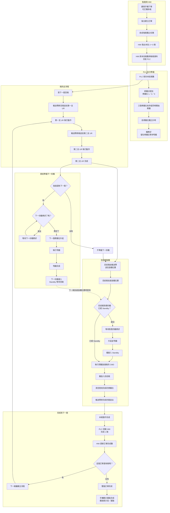
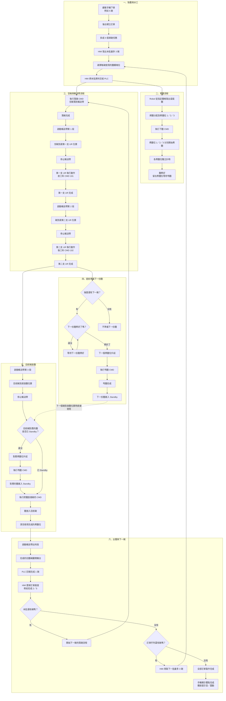
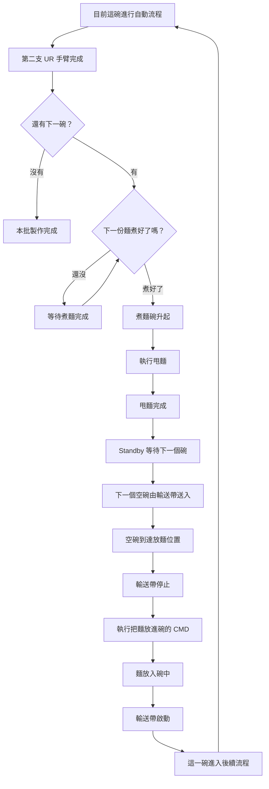
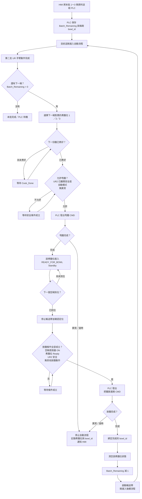

# 規劃自建點餐系統——原聊天匯出第 037 頁

Thread ID：01a0128c-710d-7be2-9e8d-3e60d4f5b5d0
順序：API以最新到最舊分頁；本頁內依回傳順序保存。

## Turn 01a012f5-d079-7b13-a09c-dc43a717530d

### 使用者

我的每一格不是平均的


### AI（final_answer）

了解，那前面「輸送帶每次走一格、所有碗同時對準下一站」的說法不適用。因為每個工作站之間的距離不同，輸送帶不能使用固定距離移動。

應改成「以最下游碗的下一個目標位置為主」：

```text
最下游碗目前位置
→ 判斷它下一個工作站
→ 輸送帶運轉
→ 最下游碗到達該站感測器
→ 輸送帶停止
→ 重新檢查所有碗目前在哪裡
```

例如實際距離可能是：

```text
落碗 ──300mm── UR1 ──650mm── UR2 ──420mm── 放麵 ──800mm── 出料
```

不能寫成：

```text
每次固定移動 500mm
```

而要保存各工作站實際位置：

```text
Station_Drop
Station_UR1
Station_UR2
Station_NoodleDrop
Station_Output
```

每次停止後，有些碗剛好在工作站，有些碗可能仍在兩個工作站之間：

```text
落碗區：空
UR1：B004
UR1 與 UR2 中間：B003
UR2：沒有碗
放麵區：B002
出料區：B001
```

PLC 停止後分別判斷：

- 落碗位置空且還有下一碗：執行落碗 CMD。
- UR1 位置有碗：執行 UR1 動作。
- UR2 位置有碗：執行 UR2 動作。
- 放麵位置有碗：執行放麵 CMD。
- 位於兩站之間的碗：不執行動作，等待下一次輸送。

因此每次輸送帶停止後，不是所有工作站都一定有碗，而是：

```text
輸送帶停止
→ 讀取各位置感測器
→ 哪個工作站有碗，就執行哪個站的動作
→ 落碗端有空位，就補下一個空碗
→ 完成後再決定最下游碗的下一個目的地
```

如果有伺服馬達／Encoder，可用實際位置管理：

```text
Bowl.position_mm
Station.position_mm
Conveyor.target_distance
```

如果只有光電感測器，就用區段管理：

```text
落碗區
落碗→UR1途中
UR1位置
UR1→UR2途中
UR2位置
UR2→放麵途中
放麵位置
放麵→出料途中
```

關鍵是「站位不是陣列等距格子」，而是每個工作站都有自己的實際位置或感測器。輸送帶停止時，落碗位置只要確認空了，就可以立即補下一個碗。

## Turn 01a012f4-c9cc-7883-85fb-5deb2f0d7b12

### 使用者

以最後端的碗為主


### AI（final_answer）

了解，整條輸送帶的節拍應該以「最下游、最接近出料端的碗」為主。它是領頭碗，其餘碗跟著輸送帶一起前進。

例如：

```text
落碗端                                         出料端
Zone 0       Zone 1       Zone 2       Zone 3       Zone 4
新空碗        B004          B003          B002          B001
                                                ↑
                                        B001 是領頭碗
```

動作邏輯：

```text
領頭碗 B001 完成最後端動作
→ 啟動輸送帶移動一個站距
→ B001 離開機台
→ B002 前進到 Zone 4
→ B003 前進到 Zone 3
→ B004 前進到 Zone 2
→ 新空碗進入 Zone 1
→ 開始下一個節拍
```

因此每個節拍可以這樣規劃：

1. 最下游碗執行目前站位動作。
2. 中間各碗同時執行各自站位動作。
3. 第二支 UR 完成後，預先替即將到放麵站的碗甩麵 Standby。
4. 最下游碗完成後，輸送帶整排前進一格。
5. 最前端空出的站位執行落碗。
6. `CMD 103` 提前替即將進入 UR1 的碗做影像辨識。
7. 所有碗重新對應新的站位，進入下一節拍。

```text
CMD 103        對應即將進入 UR1 的碗
甩麵 Standby   對應即將進入放麵站的碗
完成計數       以最下游離開機台的碗為準
輸送帶節拍     以最下游碗完成為主要推進點
```

不過即使以最下游碗為主，中間站位的動作也必須在輸送帶前進前完成；比較準確的規則是：

```text
最下游碗提出「可以前進」
＋
目前所有占用站位的動作都完成
→ 輸送帶整排前進一格
```

這樣 PLC 不再使用「一碗從頭跑到尾」的單一流程，而是每移動一格算一個生產節拍。

### 使用者

如果停止一有空就可以在下一個落碗得CMD


### AI（final_answer）

對。每次輸送帶移動一個站距並停止後，只要「落碗位置是空的」且後面還有訂單，就可以立即執行下一個落碗 CMD，不必等最下游那碗完全出餐。

```text
輸送帶移動一格
→ 輸送帶停止
→ 更新所有碗的站位
→ 檢查落碗位置
```

```text
落碗位置空
＋
還有下一碗
→ 執行落碗 CMD
→ 新空碗進入輸送帶
```

同一時間其他站位可以進行各自動作：

```text
落碗區：     執行下一個落碗 CMD
UR1 區：     第一支 UR 動作
UR2 區：     第二支 UR 動作
放麵區：     把麵放進碗
出料區：     最下游碗準備離開
```

也就是每次輸送帶停止後：

```text
Zone 0 空位 → 立即落下一個碗
Zone 1 有碗 → 執行 CMD 103／UR1
Zone 2 有碗 → 執行 UR2
Zone 3 有碗 → 執行放麵 CMD
Zone 4 有碗 → 執行出料
```

這些站位動作可以平行執行。全部需要的動作完成後，輸送帶再一起往前移動一格。

PLC 的落碗條件可先簡化成：

```text
Conveyor_Stopped
AND Drop_Zone_Empty
AND Remaining_Bowls > 0
→ Drop_Bowl_CMD
```

落碗完成後：

```text
Drop_Zone = Occupied
Remaining_Bowls = Remaining_Bowls - 1
```

因此整體應採「輸送帶走一格、停止、空位補碗、各站同時工作、再走下一格」的節拍式流水線。

## Turn 01a012f4-6180-7391-b39d-1879baec6535

### 使用者

CMD 103是UR手臂1預先影像辨識CMD


### AI（final_answer）

了解，我前面把 `CMD 103` 當成落碗／前置動作不正確。正確定義是：

```text
CMD 103：第一支 UR 手臂預先影像辨識
```

因此 `CMD 103` 與「落碗」是兩個不同動作，可以平行執行：

```text
PLC 開始本批流程
        ├─→ 發送 CMD 103
        │   → UR1 預先影像辨識
        │   → 保存辨識結果
        │
        └─→ 執行落碗 CMD
            → 空碗落到輸送帶
            → 輸送帶將空碗送往 UR1

影像辨識完成＋空碗到達 UR1
→ 第一支 UR 執行後續動作
```

目前指令定義可整理成：

```text
CMD 103：UR1 預先影像辨識
CMD 101：前三料動作
CMD 102：後三料動作
落碗 CMD：獨立的 Bowl Dispenser 動作
```

這樣設計的好處是，落碗與輸送途中就能先完成影像辨識，不必等碗到第一支 UR 才開始辨識。

另外需要補一個 `CMD 103` 的完成回報，例如：

```text
CMD：103
Response：203
意思：UR1 預先影像辨識完成
```

或使用既有的專屬完成 bit。因為目前 IPC 程式只處理 `101／102`，後續必須補上 `103` 的接收、執行與完成回報，PLC 才能知道何時可以進入 UR1 的下一個動作。

## Turn 01a012f3-d4d2-7612-920d-ab05e1885545

### 使用者

我輸送帶不一定一次只有一個碗對嗎


### AI（final_answer）

對，輸送帶上不一定只能有一個碗。你前面說「輸送帶一次只能生產一碗」，比較準確的理解應該是：

- 每個工作站一次只處理一個碗。
- 但輸送帶不同位置可以同時有多個碗。
- 輸送帶啟動時，所有碗會一起向前移動一個站位。

例如可以同時存在：

```text
落碗區     第一支 UR     第二支 UR     放麵區      出料區
  空          B003          B002          B001          空
```

這時：

- `B001` 等待放麵
- `B002` 正在第二支 UR
- `B003` 正在第一支 UR
- 三個碗屬於流水線並行，不是等 B001 完全出料才開始 B002

但目前 PDF 中只有一個全域 `Main_step 0～90`，看起來是以「一碗完整跑完，再做下一碗」的串行方式控制。即使輸送帶物理上能放多碗，現有 PLC 程式也未必有追蹤多碗位置的能力。

若要一次寫成流水線，PLC 需要管理每個站位：

```text
Zone 0：落碗區
Zone 1：第一支 UR
Zone 2：第二支 UR
Zone 3：放麵區
Zone 4：出料區
```

每個站位保存：

```text
是否有碗
bowl_id
目前動作
動作是否完成
```

例如：

```text
Zone[1] = B003
Zone[2] = B002
Zone[3] = B001
```

輸送帶移動前，PLC 確認各站動作都完成，然後整排一起位移：

```text
B003：Zone 1 → Zone 2
B002：Zone 2 → Zone 3
B001：Zone 3 → Zone 4
```

移動完成後，空出的 Zone 1 就能再落一個新碗。

因此正確架構應該是：

```text
最多三份麵同時煮
＋
輸送帶可同時承載多個碗
＋
每個工作站一次處理一碗
＋
放麵區一次只執行一個放麵 CMD
```

而第二支 UR 完成時，可以提前把即將到達放麵區之碗所對應的麵甩好並 Standby。前一張流程圖是偏向單碗串行，若確定輸送帶要採多碗流水線，PLC 主流程需改成「站位追蹤」，不能只用單一 `Main_step` 表示整台機器目前處理哪一碗。

## Turn 01a012f0-1c93-7e01-9025-80b76e8855a0

### 使用者

全部的流程


### AI（commentary）

我會把範圍擴成一張完整動作流程：手機下單、HMI 組成最多三碗、PLC 接批次、三個煮麵位、碗的輸送與兩支 UR，並加入「第二支 UR 完成後提前甩下一份麵 Standby」。仍先不放異常與安全判斷。

### AI（final_answer）

以下先畫「純動作流程」，不加入異常、逾時、安全互鎖及復歸。



整體動作重點：

```text
HMI 一次給 PLC 最多三碗資料
→ PLC 使用三個煮麵位準備麵
→ 空碗依序經過第一支及第二支 UR
→ 第二支 UR 完成後，提前甩下一份麵
→ 下一份麵進入 Standby
→ 下一個碗到放麵位置
→ 直接執行放麵 CMD
→ 每完成一碗回報 HMI
→ 全部完成後通知顧客
```

這張圖適合先確認設備的實際動作先後；確認後再加入感測器、互鎖、異常及各個 PLC Step。

### 使用者

還有輸送帶落碗等


### AI（commentary）

我會把現有 PLC 主流程的落碗、每段輸送帶移動、兩段 UR／小料動作，以及新規劃的三個煮麵位與甩麵 Standby 合併成同一張動作流程；仍不加入異常與安全判斷。

### AI（final_answer）

下面把「落碗、輸送帶、兩支 UR、前三料／後三料、三個煮麵位、甩麵 Standby、放麵及完成通知」放在同一張圖，先不加入異常與安全條件。



對應的精簡動作順序是：

```text
接收本批 1～3 碗
→ 麵櫃取麵
→ 分配三個煮麵位
→ 下麵並開始煮

同時：
落碗
→ 輸送帶第 1 段
→ 第一支 UR／前三料
→ 輸送帶第 2 段
→ 第二支 UR／後三料

第二支 UR 完成
→ 如果有下一碗
→ 提前將下一份煮好的麵升起
→ 甩麵
→ Standby

目前碗：
輸送帶第 3 段
→ 到達放麵位置
→ 把麵放進碗 CMD
→ 輸送帶送出
→ 回報完成一碗
→ 下一碗繼續
```

目前圖面中的 Step 10 有 `CMD 103`，如果它就是正式的落碗／前置動作，後續可直接把流程圖中的「落碗 CMD」標成 `CMD 103`；這個名稱仍需要你確認。

## Turn 01a012ec-343a-7d51-9846-767243950fec

### 使用者

先除掉異常什麼的我要先確認動作流程


### AI（commentary）

我先把所有異常、逾時與安全判斷拿掉，只保留「目前碗完成、下一份麵甩麵待機、空碗到位、放麵」的純動作順序。

### AI（final_answer）



簡化後的重點就是：

```text
第二支 UR 完成
→ 有下一碗
→ 下一份麵煮好
→ 先甩麵
→ Standby
→ 空碗到位
→ 放麵 CMD
→ 繼續下一碗
```

## Turn 01a012eb-1a07-75b2-99a8-ff8d49253892

### 使用者

畫流程圖給我


### AI（commentary）

我會把「第二支 UR 完成後，若有下一碗就先甩麵 Standby，等空碗到位再放麵」畫成 PLC 判斷流程圖，並把 HMI 只提供剩餘碗數的邊界標出來。

### AI（final_answer）



關鍵判斷點是第二支 UR 完成。只要 PLC 已經知道後面還有下一碗，就可以提前讓下一份煮好的麵完成甩麵並進入 `READY_FOR_BOWL`，等空碗到位後直接執行放麵 CMD。HMI 不需要在中間即時下甩麵或放麵指令。

## Turn 01a012ea-dd83-7570-9dc6-0b9f00f10bba

### 使用者

只要第二支UR手臂結束如果有下一碗就可以先甩麵standby


### AI（final_answer）

對，這樣可以把等待時間重疊掉。觸發點就是「第二支 UR 手臂完成目前這碗」，PLC 隨即檢查後面是否還有下一碗。

```text
第二支 UR 完成目前碗
        ↓
是否有下一碗？
├─ 沒有 → 維持待機
└─ 有
    ↓
下一份麵是否已煮好？
├─ 尚未 → 等待煮麵完成
└─ 已煮好
    ↓
先執行甩麵
    ↓
READY_FOR_BOWL Standby
    ↓
下一個空碗到位
    ↓
執行放麵進碗 CMD
```

PLC 判斷條件可以寫成：

```text
UR2_Done
AND Next_Bowl_Exists
AND Cooker_Cook_Done
AND NOT Noodle_Drop_Busy
AND Auto_Running
→ Start_Drain_Command
```

甩麵完成後：

```text
Drain_Done
→ Cooker_Status = READY_FOR_BOWL
```

下一個空碗到位後：

```text
Cooker_Status = READY_FOR_BOWL
AND Bowl_At_Noodle_Station
AND Conveyor_Position_OK
AND UR2_Safe_Position
AND NOT Noodle_Drop_Busy
→ Drop_Noodle_Command
```

時間軸會變成：

```text
目前碗：──── UR2動作 ──── 完成 ────────────
下一份麵：─ 煮麵中 ────── 甩麵 ─ Standby ─ 放麵
下一個碗：────────────────── 輸送中 ─ 到位
```

這裡有一個架構重點：PLC 必須提前知道「後面還有下一碗」。因此 HMI 派工時不能只給一個瞬間啟動訊號，至少要提供：

```text
待製作總數
剩餘碗數
或
最多三碗的本批任務資料
```

例如：

```text
Batch 碗數：3
目前完成：1
剩餘：2
Next_Bowl_Exists：TRUE
```

PLC 在第二支 UR 完成時直接看自己的批次剩餘數，不需要臨時等待 HMI 回覆。如此才能立即甩麵並進入 Standby。最後一碗完成時 `Next_Bowl_Exists = FALSE`，就不預先執行下一次甩麵。

## Turn 01a012e9-a19c-7bf0-b10f-9353b4e666fb

### 使用者

麵煮碗可以先甩麵然後等下一個碗到直接做把麵放進碗的CMD


### AI（final_answer）

了解，正確流程應該是「麵煮好後先甩麵／瀝水，保留在煮麵碗等待；空碗到達指定位置後，PLC 再下 CMD 把麵放進碗裡」。

```text
麵開始煮
→ 煮麵完成
→ 煮麵碗升起
→ 執行甩麵／瀝水
→ 麵在上方等待
→ 下一個空碗到達
→ 輸送帶停止定位
→ PLC 發出放麵 CMD
→ 確認麵已放入碗
→ 輸送帶繼續
```

三個煮麵位可以分別處於不同狀態：

```text
煮麵位 1：麵已甩好，等待空碗
煮麵位 2：煮麵中
煮麵位 3：等待下麵
輸送帶：正在送下一個空碗
```

PLC 發出「放麵進碗 CMD」前，必須同時確認：

- 該煮麵位已完成煮麵及甩麵。
- 該煮麵位有對應的 `bowl_id`。
- 空碗已由感測器確認到位。
- 輸送帶已停止並完成定位。
- 放麵機構在原點且無異常。
- 目前沒有其他煮麵位正在放麵。

PLC 內部狀態建議調整為：

```text
EMPTY
→ COOKING
→ LIFTING
→ DRAINING
→ READY_FOR_BOWL
→ DROPPING_TO_BOWL
→ DROP_CONFIRMED
→ EMPTY
```

當多個煮麵位都在等待空碗時，建立 PLC 內部「待放麵佇列」：

```text
等待順序：
1. CookerSlot 2／A023-02
2. CookerSlot 1／A024-01
3. CookerSlot 3／A024-02
```

下一個空碗到位後，PLC 只讓佇列第一個煮麵位執行放麵 CMD。

必要訊號可以規劃成：

```text
Bowl_At_Noodle_Station       空碗到位
Conveyor_Position_OK         輸送帶定位完成
Cooker_Ready[1..3]           麵已甩好
Drop_Noodle_Command[1..3]    對應煮麵位放麵
Drop_Noodle_Busy             放麵動作中
Drop_Noodle_Done             放麵完成
Drop_Noodle_Error            放麵異常
```

放麵完成後才可以：

1. 將該 `bowl_id` 標記為已放麵。
2. 清空對應煮麵位。
3. 允許煮麵位接受下一份麵。
4. 啟動輸送帶將碗送往下一站。

HMI 不需要發出這個即時放麵 CMD；HMI 只提供這批有哪些 `bowl_id`。空碗到位、選擇哪個煮麵位、甩麵、放麵及輸送帶互鎖，都由 PLC 自動流程處理。

## Turn 01a012e9-6790-7822-8490-0d7d7ed8dd81

### 使用者

麵煮碗可以先甩麵然後等下一個碗到直接做下麵的CMD


